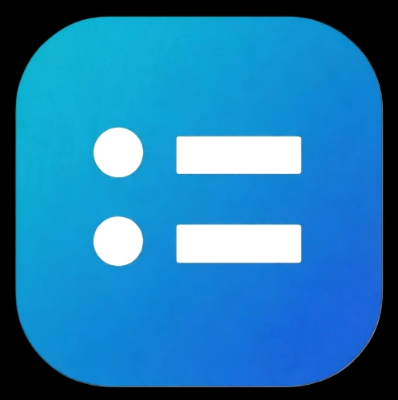

<p align="center">
  
</p>

<h1 align="center">RealPLC Agent</h1>

<p align="center">
  <strong>让 AI 生成的 PLC 程序，进入真实工业软件完成闭环验证。</strong>
</p>

<p align="center">
  RealPLC AI × CODESYS × PLC Engineering
</p>

---

## 🚀 RealPLC Agent 是什么？

**RealPLC Agent** 是运行在 Windows 本地的工业软件连接组件。

它负责连接 **RealPLC AI** 与本机 PLC 开发环境，让 AI 不仅能够生成 PLC 程序，还可以进一步进入真实工程环境进行验证。

当前版本：

> **v0.4.0 — 重点支持 RealPLC × CODESYS 闭环验证**

---

## 🔄 CODESYS 闭环验证

传统 AI PLC 编程：

```text
需求
 ↓
AI 生成 ST
 ↓
人工复制到 CODESYS
 ↓
手动编译和修改
```

RealPLC v0.4.0：

```text
用户需求
   ↓
RealPLC AI
   ↓
生成 ST
   ↓
RealPLC Agent
   ↓
CODESYS
   ↓
真实验证
   ↓
Diagnostics
   ↓
AI 分析 / 修复
   ↓
再次验证
```

我们的目标很简单：

> **AI 不再自己判断代码“应该可以运行”，而是交给真实 PLC 工程环境验证。**

---

## ✨ v0.4.0 主要功能

- 🤖 AI 生成 PLC Structured Text 程序
- 🔗 RealPLC Agent 本地连接
- ⚙️ CODESYS 工程闭环验证
- 🔍 获取真实验证结果
- 🧾 Diagnostics 诊断结果返回
- 🔄 支持 AI 分析错误并继续修复
- 📋 Agent 本地运行状态与日志
- 🛡️ 云端 AI 与本地工程环境分离

核心流程：

**Generate → Validate → Diagnose → Fix → Validate Again**

---

## 📥 下载

进入本仓库：

**Releases → v0.4.0**

下载：

```text
RealPLC-Agent-Setup-v0.4.0.exe
```

安装完成后启动：

```text
RealPLC Agent
```

按照 Agent 界面的提示连接 RealPLC 与 CODESYS。

---

## 🧪 使用建议

v0.4.0 仍属于早期公开测试版本。

建议优先使用：

- CODESYS 测试工程
- 工程副本
- 虚拟 PLC
- Sandbox 环境

> ⚠️ 请勿未经工程师确认，直接将 AI 生成的程序用于真实生产设备。

---

## 🔜 下一步

### ⚙️ CODESYS

继续完善：

- AI 自动修复
- 多轮闭环验证
- Diagnostics 标准化
- 验证历史与报告
- Agent 稳定性

### 🔷 Siemens TIA Portal

下一阶段将重点推进：

- TIA Portal Openness
- PLC 工程读取
- OB / FB / FC / DB
- SCL 导入
- Compile
- Diagnostics
- AI 自动修复
- TIA 编译闭环验证

```text
RealPLC AI
     ↓
RealPLC Agent
     ↓
TIA Portal Openness
     ↓
TIA Portal
     ↓
Compile / Diagnostics
```

---

## 🗺️ Roadmap

- RealPLC Agent 本地运行框架
- CODESYS 闭环验证
- 验证结果回传
- Diagnostics 基础链路
- AI 自动修复
- 多轮自动验证
- 验证历史与报告
- TIA Portal Openness
- TIA Compile 闭环
- 更多 PLC 开发平台

---

## 🐛 问题反馈

如果遇到：

- Agent 连接问题
- CODESYS 兼容问题
- 验证失败
- 安装问题
- Diagnostics 异常

欢迎提交 **GitHub Issue**。

提交问题时建议附带：

- RealPLC Agent 版本
- Windows 版本
- CODESYS 版本
- 错误截图
- Agent 日志

---

## 🌐 About RealPLC

**RealPLC** 是面向 PLC 与工业自动化工程师的 AI 工程平台。

我们希望让 AI 从：

```text
PLC Code Generator
```

逐渐进化成为：

```text
PLC Engineering Agent
```

最终实现：

> **理解需求 → 生成代码 → 真实验证 → 发现错误 → 自动修复 → 再次验证**

🌐 **Website:** [https://www.realplc.com](https://www.realplc.com)

---

<p align="center">
  <strong>RealPLC Agent v0.4.0</strong>
</p>

<p align="center">
  AI × PLC × CODESYS × Engineering Validation
</p>
