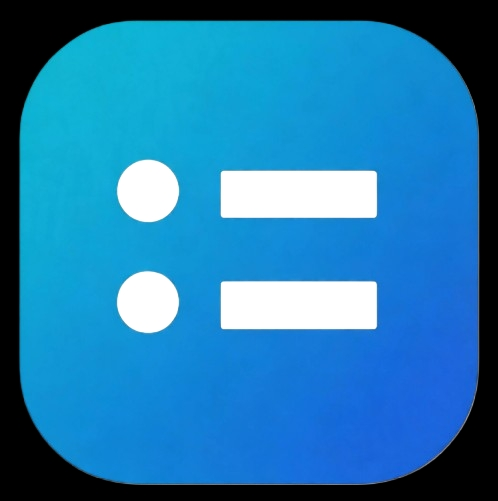

<p align="center">
  
</p>

<h1 align="center">RealPLC Agent</h1>

<p align="center">
  <strong>让 AI 生成的 PLC 程序，进入真实工业软件完成闭环验证。</strong>
</p>

<p align="center">
  RealPLC AI × CODESYS × Siemens TIA Portal
</p>

<p align="center">
  <a href="https://www.realplc.com">官网</a> ·
  <a href="https://github.com/JadeHuang/RealPLC-Agent/releases/tag/v1.1.3">下载 v1.1.3</a> ·
  <a href="https://github.com/JadeHuang/RealPLC-Agent/issues">问题反馈</a> ·
  <a href="CHANGELOG.md">更新日志</a>
</p>

---

## 🚀 RealPLC Agent 是什么？

**RealPLC Agent** 是运行在 Windows 本地的工业软件连接组件。

它负责连接 **RealPLC AI** 与本机 PLC 开发环境，让 AI 不仅能够生成 PLC 程序，还可以进一步进入真实工程环境进行验证。

当前版本：

> **v1.1.3 — 带中文注释的程序完整导入 TIA Portal，云端连接断开后自动恢复，主窗口重新排版**

---

## 🔄 CODESYS 闭环验证

传统 AI PLC 编程：

```text
需求
 ↓
AI 生成 ST
 ↓
人工复制到 CODESYS
 ↓
手动编译和修改
```

RealPLC Agent：

```text
用户需求
  ↓
RealPLC AI
  ↓
生成 ST
  ↓
RealPLC Agent
  ↓
CODESYS
  ↓
真实验证
  ↓
Diagnostics
  ↓
AI 分析 / 修复
  ↓
再次验证
```

我们的目标很简单：

> **AI 不再自己判断代码“应该可以运行”，而是交给真实 PLC 工程环境验证。**

---

## ✨ v1.1.3 主要功能

- 🤖 AI 生成 PLC Structured Text 程序
- 🔗 RealPLC Agent 本地连接
- ⚙️ CODESYS 工程闭环验证
- 🔍 获取真实验证结果
- 🧾 Diagnostics 诊断结果返回
- 🔄 支持 AI 分析错误并继续修复
- 📋 Agent 本地运行状态与日志
- 🛡️ 云端 AI 与本地工程环境分离
- 💽 在已就绪的本地固定磁盘上发现 CODESYS / TIA 安装
- 📂 支持手动选择非标准安装路径
- 🖥️ 改善 Windows 高 DPI、中文字体与窄窗口下的界面布局
- ✅ 构建时强制校验发布 EXE 与 Connector Manifest 版本
- 🔷 兼容 TIA Portal V21+ 模块化 Openness PublicAPI，同时保留旧版本入口识别
- 🎯 首次自动选择本机最高 TIA / CODESYS 版本，之后固定使用用户手动选择
- 🧰 CODESYS Scripting 缺失时可从 Agent 中直接安装或修复
- 📖 说明文档使用即时原生渲染，可用系统浏览器打开本地增强排版，无需 WebView2
- 📡 TIA 状态以真实 Openness 成功操作为依据，避免进程扫描误报“未运行”
- 🎛️ 多个 TIA 实例同时打开项目时要求明确选择 ProcessId，避免连接错误工程
- 🧪 CODESYS 增加实际 `--runscript --noUI` 能力验证，区分组件文件存在和真正可用
- 🗂️ TIA 与 CODESYS 的项目树、诊断、摘要和原始结果按工作区隔离
- 🕘 提供最近 30 天任务记录和“更多 → 检查软件更新”入口
- 🔷 增加 TIA Portal Project Discovery，获取项目、PLC 与 TIA 版本信息
- 📋 支持读取 Program Cycle OB 信息
- 🎯 支持 TIA Target Project
- 🧪 支持 Target Project 中的 SCL Validation / Compile
- 🔄 支持 Target Project 创建或复制，避免直接修改用户原始项目
- 🔌 增加 CloudBridge Job Contract 与 Validation Job
- 📡 完善 Worker → CloudBridge → Agent 的 Result 返回链路
- 🧰 Installer 自动注册 TIA Openness Worker 到 whitelist
- 🧹 Installer 卸载时自动清理 Worker 注册
- 📦 Release 支持构建到独立 staging folder，无需停止正在运行的 Agent
- 🧪 增加 CloudBridge、Worker 与 Target Job 的端到端测试
- 👁️ TIA Portal 可见验证：打开或创建工程、导入候选程序、原生编译并读取块级诊断
- 🔁 根据编译诊断在同一 Run 内导入修复候选并再次编译
- 🔐 首次 Openness 授权时提示用户在 TIA 窗口完成操作
- 🧩 修复原生验证建运行记录时运行计划 ID 超长导致的数据库写入失败
- ⚡ CODESYS 检测与本地服务检查改为后台执行，装有 CODESYS 的电脑上窗口不再周期性卡顿
- 🚀 窗口先于 AgentHost 出现，启动更快；重复启动会把已有窗口调到前台
- 🏷️ 主页直接显示所连接的 IDE 版本，例如 TIA V18、CODESYS SP21 P5
- 🧪 CODESYS IDE 打开时也可以验证 Scripting
- 🈶 带中文注释的 SCL 源文件完整导入 TIA Portal，变量声明不再丢失
- 🪟 TIA 验证结束后在编辑器中打开导入的程序（Main），窗口进入项目视图；从验证结果打开的工程同样如此
- 🔁 服务端重启后云端连接自动恢复，云端状态如实显示
- ⏱️ “保存并连接”“断开连接”和环境配置向导不再让窗口无响应
- 🧭 主窗口重新排版：侧栏按钮大小统一，概览页按“名称 / 值”对齐
- 🔎 缩放高于 100% 的显示器上，正文、列表、表格和标签页的文字更清晰

核心流程：

**Generate → Validate → Diagnose → Fix → Validate Again**

---

## 📥 下载

**[⬇️ 打开 RealPLC Agent v1.1.3 发布页（Windows x64）](https://github.com/JadeHuang/RealPLC-Agent/releases/tag/v1.1.3)**

| 项目 | 信息 |
| --- | --- |
| 版本 | `v1.1.3` |
| 文件名 | `RealPLC_Agent_V1.1.3_Setup_x64.exe` |
| SHA-256 | `8848CC3D9D85F55D6F83D84D571EA755CAC842F9C9B3A18DD6F0515F196F27C5` |
| 发布状态 | 正式 Release（公开测试） |
| 数字签名 | 当前安装包是否签名以 Release 资产说明为准 |

可在 PowerShell 中校验下载文件：

```powershell
Get-FileHash .\RealPLC_Agent_V1.1.3_Setup_x64.exe -Algorithm SHA256
```

请将计算结果与上表中的 SHA-256 值核对。

安装完成后启动：

```text
RealPLC Agent
```

按照 Agent 界面的提示连接 RealPLC 与 CODESYS / TIA Portal。

### 系统要求

- Windows 10/11 x64；安装程序需要管理员权限。
- CODESYS V3.5 SP15 及更高 Service Pack；首次运行默认选择已发现的最高版本，用户选择后保持固定。
- 需要官方 CODESYS Scripting 组件才能执行 IDE 自动化验证。
- TIA Portal Openness 支持传统 `Siemens.Engineering.dll` 入口及 V21+ `Siemens.Engineering.Base.dll` 模块化入口；需安装对应版本的 Openness 组件。
- TIA Portal 自动化功能需要本机安装对应版本的 TIA Portal。
- 安装程序在系统缺失时提供 .NET Framework 4.8 安装支持；文档查看不依赖 Microsoft Edge WebView2 Runtime。
- 需要网络连接 RealPLC 服务；PLC 工程验证在本机执行。

不同 OEM IDE、Profile、补丁版本和工程插件可能影响兼容性。遇到问题请在 Issue 中附上完整版本信息。

---

## 🧪 使用建议

v1.1.3 仍属于公开测试版本。

建议优先使用：

- CODESYS 测试工程
- TIA Portal 测试工程
- 工程副本
- Target Project
- 虚拟 PLC
- Sandbox 环境

> ⚠️ 请勿未经工程师确认，直接将 AI 生成的程序用于真实生产设备。

### 安全与数据边界

- CODESYS 验证链支持原生编译和 IDE Simulation，不自动下载到真实 PLC 或 Control Win / SoftMotion Runtime。
- TIA 验证优先使用 Target Project，避免直接修改用户自己的原始工程。
- 工程验证在本机环境、工程副本或 Target Project 中执行，云端与本地工程环境保持分离。
- 日志和验证数据保存在当前 Windows 用户的本地应用数据目录中。
- 提交 Issue 前请删除项目源码、访问令牌、设备密钥、客户名称和其他敏感信息。

详细说明请参阅 [数据与隐私说明](DATA_AND_PRIVACY.md) 和 [安全策略](SECURITY.md)。

---

## 🔜 下一步

### ⚙️ CODESYS

继续完善：

- AI 自动修复
- 多轮闭环验证
- Diagnostics 标准化
- 验证历史与报告
- Agent 稳定性

### 🔷 Siemens TIA Portal

v1.1.1 已打通可见 TIA 导入、原生编译和诊断回传，下一阶段将继续完善：

- TIA Portal 多版本兼容回归
- PLC 工程读取能力
- OB / FB / FC / DB 更完整的工程读取
- SCL 导入与工程集成
- Compile 能力增强
- Diagnostics 标准化
- AI 自动修复
- TIA 编译闭环验证
- 更完整的 Target Project 自动化

```text
RealPLC AI
     ↓
RealPLC Agent
     ↓
CloudBridge
     ↓
TIA Worker
     ↓
TIA Portal Openness
     ↓
TIA Portal
     ↓
Compile / Validation
     ↓
Result
```

---

## 🗺️ Roadmap

- RealPLC Agent 本地运行框架
- CODESYS 闭环验证
- 验证结果回传
- Diagnostics 基础链路
- AI 自动修复
- 多轮自动验证
- 验证历史与报告
- TIA Portal 多版本 Openness
- TIA Project Discovery
- TIA Target Project
- TIA SCL Validation
- TIA Compile 闭环
- CloudBridge / Worker 工程自动化
- 更多 PLC 开发平台

---

## 🐛 问题反馈

如果遇到：

- Agent 连接问题
- CODESYS 兼容问题
- TIA Portal 兼容问题
- 验证失败
- 安装问题
- Diagnostics 异常
- CloudBridge / Worker 问题

欢迎提交 [GitHub Issue](https://github.com/JadeHuang/RealPLC-Agent/issues/new/choose)。

提交问题时建议附带：

- RealPLC Agent 版本
- Windows 版本
- CODESYS 版本
- TIA Portal 版本（如适用）
- 错误截图
- Agent 日志
- Worker 日志（如适用）

更多排障信息请参阅 [支持说明](SUPPORT.md)。

---

## 🌐 About RealPLC

**RealPLC** 是面向 PLC 与工业自动化工程师的 AI 工程平台。

我们希望让 AI 从：

```text
PLC Code Generator
```

逐渐进化成为：

```text
PLC Engineering Agent
```

最终实现：

> **理解需求 → 生成代码 → 真实验证 → 发现错误 → 自动修复 → 再次验证**

🌐 **Website:** [https://www.realplc.com](https://www.realplc.com)

## 📚 项目文档

- [v1.1.3 发布说明](https://github.com/JadeHuang/RealPLC-Agent/releases/tag/v1.1.3)
- [v1.1.2 发布说明](https://github.com/JadeHuang/RealPLC-Agent/releases/tag/v1.1.2)
- [v1.1.1 发布说明](https://github.com/JadeHuang/RealPLC-Agent/releases/tag/v1.1.1)
- [v1.1.0 发布说明](https://github.com/JadeHuang/RealPLC-Agent/releases/tag/v1.1.0)
- [v0.4.5 发布说明](docs/RELEASE_NOTES_v0.4.5.md)
- [v0.4.4 发布说明](docs/RELEASE_NOTES_v0.4.4.md)
- [更新日志](CHANGELOG.md)
- [兼容性说明](docs/COMPATIBILITY.md)
- [支持与问题反馈](SUPPORT.md)
- [数据与隐私说明](DATA_AND_PRIVACY.md)
- [安全策略](SECURITY.md)
- [第三方组件声明](THIRD_PARTY_NOTICES.md)
- [版本发布流程](docs/RELEASE_PROCESS.md)
- [许可声明](LICENSE.md)

---

<p align="center">
  <strong>RealPLC Agent v1.1.3</strong>
</p>

<p align="center">
  AI × PLC × CODESYS × TIA Portal
</p>
